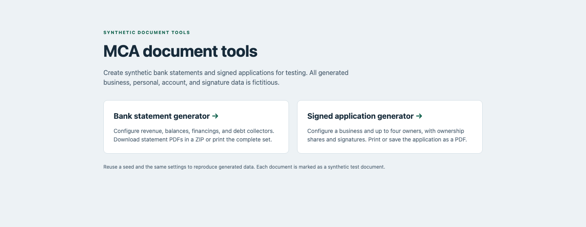
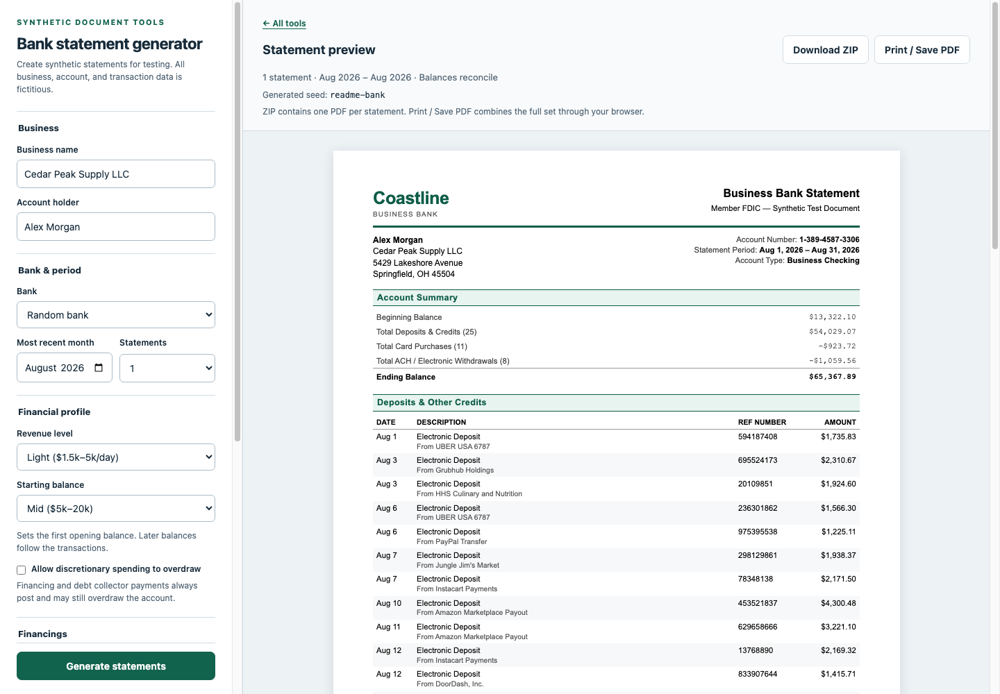
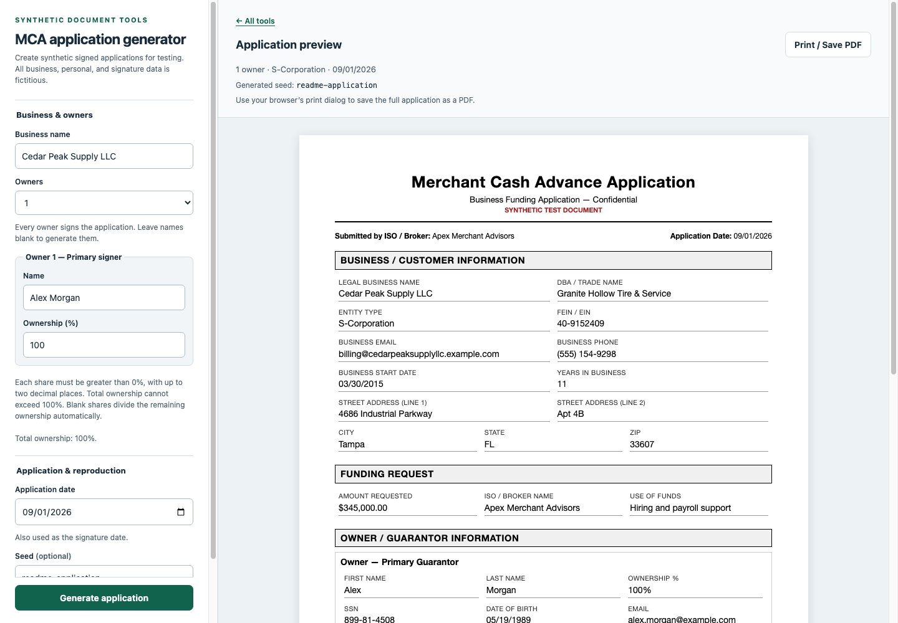

# MCA document tools

Standalone browser tools for generating synthetic bank statements and signed
merchant cash advance (MCA) applications. Use them to exercise document processing,
reconciliation, and OCR workflows with reproducible sample data.

Generation happens in the browser. All documents carry synthetic-test markings.
Revenue tiers, financing schedules, and ownership options define sample scenarios.

## Screenshots

### Tool selection



### Bank statement generator



### Signed application generator



## How To Run

From this directory:

```sh
python3 -m http.server 8000 --directory site
```

Open the served site in your browser, then choose a generator. Native JavaScript modules
require serving over HTTP rather than opening the files directly. No build or
package installation is needed.

Run the regression suite with Node.js 22 or later:

```sh
npm test
```

The suite uses Node's built-in test runner and has no external dependencies.

## Structure

- `site/` contains the complete frontend. Its landing page links to
  `bank-statements/` and `mca-applications/`; all local URLs are relative so a
  nested path works as well as a domain root.
- `site/assets/css/` contains the shared application shell and separate landing,
  bank-document, and application-document styles. Each tool owns its print rules.
- `site/assets/js/shared/` contains seeded randomness, formatting and HTML
  escaping, configuration errors, and accessible UI feedback/dropdown helpers.
- Each tool's JavaScript directory separates catalogs (`data.js`), pure generation
  and validation (`generation.js`), pure document markup (`rendering.js`), and
  browser orchestration (`main.js`). The bank tool additionally owns `pdf.js`.
- `tests/` contains regression checks and frozen baseline fixtures. It is not part
  of the website and uses only files included in this project.

The controllers maintain independent draft settings and generated results. Only
Generate applies edits; invalid settings preserve the existing preview. Generated
data and rendered document HTML are reproducible with the same explicit settings
and seed. Preserve random draw order and catalog order when
making changes that should keep existing seeds compatible.

The bank page retains html2canvas 1.4.1, jsPDF 2.5.1, and JSZip 3.10.1 from the
existing cdnjs URLs for ZIP/PDF export. Its browser printing remains available if
those libraries cannot load. The application and landing pages have no external
runtime dependencies. No backend, persistence, or integration service is added.

## Collector Catalog

Ten fictional collector agencies and their statement aliases are embedded in the
bank's `data.js` as `{ name, aliases }` records. Their names begin with “Example”
and are not intended to identify real agencies. Update this catalog directly to
customize the sample transactions. No external document or account access is required.

## OCR Compatibility

The bank-statement layout is intended for MoneyThumb OCR testing. No MoneyThumb
API integration is included. The automated tests validate generated arithmetic,
document rendering, and export behavior; they do not verify OCR classification.

## Validation

The regression suite checks exact seeded data/document parity, shared randomness,
ledger continuity and reconciliation, calendar boundaries, financing and collector
payments, presentation-only corruption, and application ownership and signatures.
Fixed-seed expectations are stored in `tests/fixtures/generation-baselines.json`.

For UI changes, serve both the site root and a nested URL, then check navigation,
pending settings, inline errors, keyboard focus, narrow screens, and printing.
Export checks should cover one and six statements, dense activity, ZIP filenames,
locking and failure recovery, plus one- and four-owner signed applications.

## Hosting

Serve `site/` from any static HTTP host. The project requires no server-side
application, build step, or platform-specific configuration. Keep future tool
additions separate while extracting genuinely common helpers.
